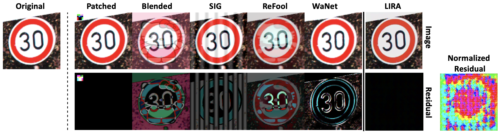

# Official PaddlePaddle Implementation of Invisible Backdoor Attacks


**LIRA: Learnable, Imperceptible and Robust Backdoor Attacks** [[Paper](https://openaccess.thecvf.com/content/ICCV2021/html/Doan_LIRA_Learnable_Imperceptible_and_Robust_Backdoor_Attacks_ICCV_2021_paper.html)] [[Slides](resources/ICCV2021-LIRA-Slides.pdf)] [[Poster](resources/ICCV2021-LIRA-Poster.pdf)]
\
Khoa D. Doan, Yingjie Lao, Weijie Zhao, Ping Li



Abstract: *Recently, machine learning models have been demonstrated to be vulnerable to backdoor attacks, primarily due to the lack of transparency in black-box models such as deep neural networks. A third-party model can be poisoned such that it works adequately in normal conditions but behaves maliciously on samples with specific trigger patterns. However, in most existing backdoor attack methods, the trigger injection function is manually defined, e.g., placing a small patch of pixels on an image or slightly deform the image before poisoning the model. This results in a two-stage approach with a sub-optimal attack success rate and a lack of complete stealthiness under human inspection.  In this paper, we propose a novel and stealthy backdoor attack framework, LIRA, which jointly learns the optimal, stealthy trigger injection function and poisons the model. We formulate such an objective as a non-convex, constrained optimization problem. Under this optimization framework, the trigger generator function will learn to manipulate the input with imperceptible noise, with the goal of preserving the model performance on the clean data and maximizing the attack success rate on the poisoned data. Then, we solve this challenging optimization problem with an efficient, two-stage stochastic optimization procedure. Finally, the proposed attack framework achieves 100% success rates in several benchmark datasets, including MNIST, CIFAR10, GTSRB, and Tiny-ImageNet, while simultaneously bypassing existing backdoor defense methods and human inspection.*

## Prerequisites
We need the following:
* conda or miniconda (preferred)
* GPU or CPU

## Setup the environment
Clone the repository. The setup script to initialize and activate the environment is collected in `etc/setup_env`. Simply run the following command:
```
. etc/setup_env_paddle
```

## Repository artifacts

* `paddle`: code to run the paddlepaddle version
* `requirements.txt`: list of python reqs
* `README.md`: this doc, and light documentation of this repos.

## Stage 1: Trigger Generation

LIRA learns to generate the trigger in Stage 1. Depending on the dataset and the attack mode, the corresponding command will be different. For examples, we can run this process for MNIST and CIFAR10 as follows:

MNIST
```
. etc/setup_env_paddle
python paddle/lira_trigger_generation.py --dataset mnist --clsmodel mnist_cnn --path experiments/ --epochs 10 --train-epoch 1 --mode all2one --target_label 0 --epochs_per_external_eval 10 --cls_test_epochs 5 --verbose 2 --batch-size 128 --alpha 0.5 --eps 0.01 --avoid_clsmodel_reinitialization
```
CIFAR10
```
. etc/setup_env_paddle
python paddle/lira_trigger_generation.py --dataset cifar10 --clsmodel vgg11 --path experiments/ --epochs 50 --train-epoch 1 --mode all2one --target_label 0 --epochs_per_external_eval 10 --cls_test_epochs 5 --verbose 2 --batch-size 128 --alpha 0.5 --eps 0.01 --avoid_clsmodel_reinitialization
```

## Stage 2: Backdoor Injection

After the trigger is learned, LIRA poison and fine-tune the classifier in Stage 2. For examples, we can run this process for MNIST and CIFAR10 as follows:

MNIST
```
. etc/setup_env_paddle
python paddle/lira_backdoor_injection.py --dataset mnist --clsmodel mnist_cnn --path experiments/ --epochs 10 --train-epoch 1 --mode all2one --target_label 0 --epochs_per_external_eval 10 --cls_test_epochs 5 --verbose 2 --batch-size 128 --alpha 0.5 --eps 0.01 --avoid_clsmodel_reinitialization --test_eps 0.01 --test_alpha 0.5 --test_epochs 50 --test_lr 0.01 --schedulerC_lambda 0.1 --schedulerC_milestones 10,20,30,40 --test_use_train_best
```

CIFAR10
```
. etc/setup_env_paddle
python paddle/lira_backdoor_injection.py --dataset cifar10 --clsmodel vgg11 --path experiments/ --epochs 50 --train-epoch 1 --mode all2one --target_label 0 --epochs_per_external_eval 10 --cls_test_epochs 5 --verbose 2 --batch-size 128 --alpha 0.5 --eps 0.01 --avoid_clsmodel_reinitialization --test_eps 0.01 --test_alpha 0.5 --test_epochs 250 --test_lr 0.01 --schedulerC_lambda 0.1 --schedulerC_milestones 50,100,150,200 --test_use_train_best
```


## Citation
Thank you for your interest in our work. Please cite it using the following:

```
@inproceedings{Doan2021lira,
  title     = {LIRA: Learnable, Imperceptible and Robust Backdoor Attacks},
  author    = {Khoa D. Doan and Yingjie Lao and Weijie Zhao and Ping Li},
  booktitle = {Proceedings of the IEEE International Conference on Computer Vision},
  year      = {2021}
}
```
